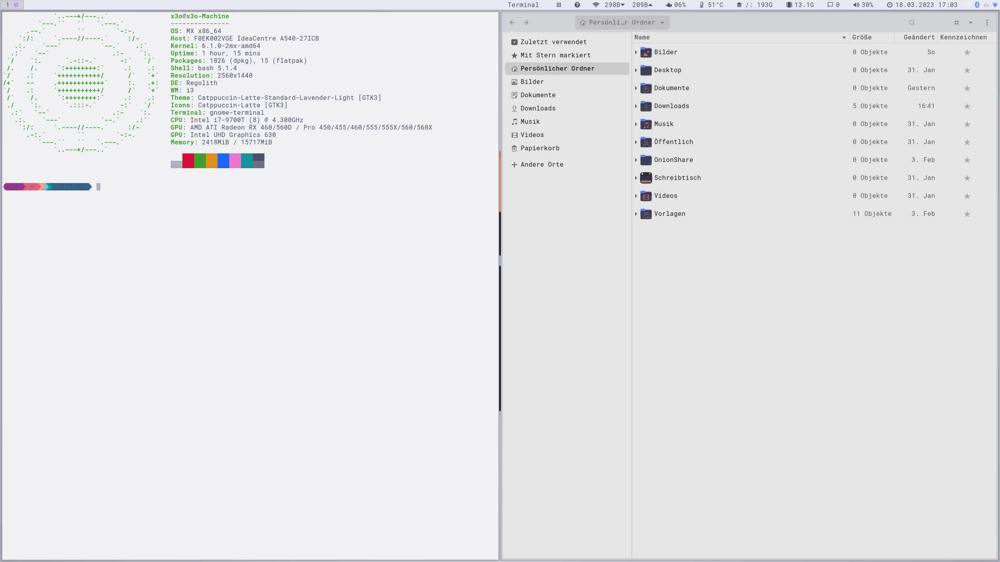

# Regolith-Look-Catppuccin

### Regolith-Look-Catppuccin
#### for Regolith Desktop 2.2

##### Extract
##### Regolith-Look-Everforest.tar.xz
##### to /usr/share/themes/ - /usr/share/icons/ - /usr/share/regolith-look/

##### Press SUPER+ALT+L to select the new Everforest look

